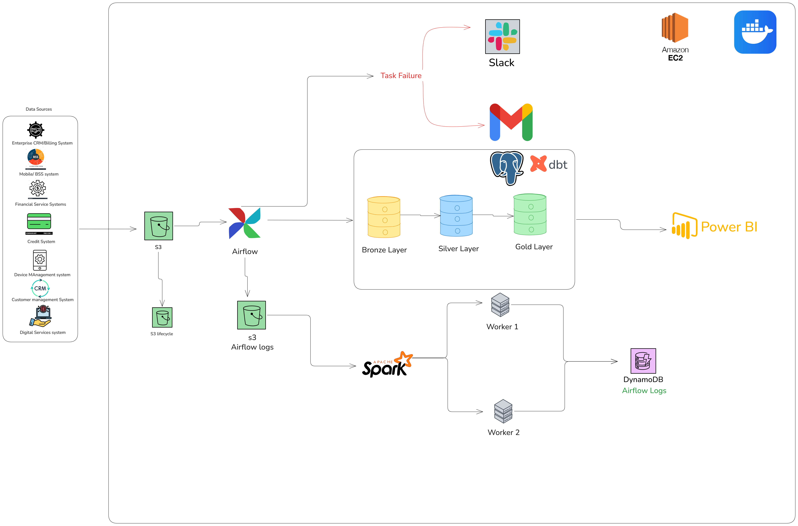

# Customer 360 Data Platform

## 1. Project Overview 
### 1.1 Project Name 
KenyaFintech Customer 360 Data Platform

### 1.2 Project Description 
KenyaFintech Customer 360 is a data platform designed for a fictional Kenyan telecom and financial services company that provides mobile connectivity, mobile money, home fiber, credit services, enterprise solutions, digital services and devices.

The platform brings customer information from multiple business domains into a unified analytical view. It enables the organization to understand how individual customers and businesses interact with different products and services across the company.

The platform will also provide a serving layer that allows customer profiles to be accessed efficiently by downstream applications and services.

In addition to customer analytics, the platform will include an observability pipeline that processes Airflow execution logs and produces operational metrics about the health and performance of data pipelines.

The project uses synthetic data only. No real customer or financial information will be used.

## 2. Business Context
A telecom and fintech company typically operates multiple systems for different products.

A single customer may:

- Use mobile voice services
- Purchase mobile data bundles
- Send and receive mobile money
- Make merchant payments
- Use credit or overdraft products
- Subscribe to home fiber
- Purchase a smartphone or router
- Use digital services
- Operate a business account
- Subscribe to enterprise connectivity or cloud services

When these activities are stored independently, it becomes difficult to obtain a complete view of the customer.

For example, the mobile system may know that a customer frequently purchases data bundles, while the financial services system knows that the same customer makes frequent transactions, and the fiber system knows that the customer has an active home internet subscription.

A Customer 360 platform connects these records through a common customer identity.

## 3. Problem Statement
The organization currently has customer information distributed across multiple product and operational systems.

This creates several challenges:

- Customer information is fragmented across systems.
- Product usage cannot easily be analyzed across business domains.
- Customer value is difficult to calculate consistently.
- Cross-product customer behavior is difficult to identify.
- Applications cannot easily retrieve a unified customer profile.
- Data teams spend significant time joining data from different systems.
- Pipeline failures and performance issues are difficult to analyze historically.

The project addresses these challenges by creating a centralized data platform and a unified Customer 360 data model.

## 4. Proposed Solution 
The proposed platform will:

1. Generate realistic synthetic data representing the company's business domains.
2. Store raw data in Amazon S3.
3. Use Apache Airflow to orchestrate data ingestion and transformation workflows.
4. Load analytical data into PostgreSQL.
5. Use dbt to transform and model the warehouse data.
6. Build a unified Customer 360 data mart.
7. Publish curated customer profiles to Amazon DynamoDB.
8. Collect and store Airflow execution logs.
9. Use Apache Spark to process Airflow logs and calculate pipeline metrics.
10. Store pipeline metrics in DynamoDB.
11. Send email and Slack notifications when Airflow tasks fail.
12. Deploy the platform on AWS infrastructure.

## 5. Business Domains
The platform will model the following domains.

### 5.1 Customer

Contains core customer information such as:

- Customer ID
- Customer type
- Registration date
- Location
- Customer status

### 5.2 Mobile Services

Includes:

- Voice usage
- SMS usage
- Mobile data usage
- Data bundles
- Mobile service revenue

### 5.3 Financial Services

Includes:

- Person-to-person transactions
- Merchant payments
- Bill payments
- Airtime purchases
- Deposits and withdrawals
- Credit and overdraft products

### 5.4 Home Fiber

Includes:

- Fiber subscriptions
- Internet plans
- Subscription status
- Monthly charges
- Data consumption

### 5.5 Devices

Includes:

- Smartphones
- Routers
- Device purchases
- Payment plans
- Device revenue

### 5.6 Enterprise Services

Includes:

- Dedicated connectivity
- Cloud services
- Web hosting
- Cybersecurity
- Bulk messaging
- Enterprise revenue

### 5.7 Digital Services

Includes usage of digital products and services such as:

- Music services
- Super-app services
- Digital agriculture services
- Other digital products

### 5.8 Credit

Includes:

- Credit products
- Disbursements
- Repayments
- Outstanding balances
- Credit status

## 6. Architecture 

## 7. Technological Stack
| Component | Technology | Purpose |
|---|---|---|
| Data Lake | Amazon S3 | Raw data and log storage |
| Orchestration | Apache Airflow | Pipeline scheduling and execution |
| Warehouse | PostgreSQL | Analytical data warehouse |
| Transformation | dbt | SQL transformations and modeling |
| Processing | Apache Spark | Airflow log and metrics processing |
| Serving Layer | Amazon DynamoDB | Customer and metrics serving |
| Infrastructure | Amazon EC2 | Initial deployment |
| Containerization | Docker | Application packaging |
| Alerting | Email + Slack | Pipeline failure notifications |
| Testing | Pytest + dbt tests | Data and pipeline testing |
| Dashboard | Power BI | Data Visualization and Reporting

---
## 8. Expected Outcome 
The project will produce:

Customer 360 Data Mart

A unified analytical model containing information about:

- Customer profile
- Product ownership
- Product usage
- Financial activity
- Fiber subscriptions
- Device ownership
- Enterprise services
- Customer value
- Last activity
- Number of products used

Customer 360 Serving Layer

A DynamoDB representation of the latest customer profile that can be accessed efficiently by applications.

Pipeline Metrics

Metrics describing:

- DAG execution time
- Task execution time
- Task success and failure rates
- Retry counts
- Error counts
- Records processed
- Pipeline execution status

Operational Alerts

Email and Slack notifications when pipeline tasks fail.

## 9. Project Philosophy
The project is designed around a separation of responsibilities:

Airflow orchestrates the workflows.

PostgreSQL stores analytical data.

dbt performs SQL-based transformations and modeling.

Spark processes Airflow operational logs and calculates pipeline metrics.

DynamoDB provides fast access to curated Customer 360 profiles and pipeline metrics.

S3 provides durable storage for raw data and logs.

This separation prevents individual technologies from being used where they do not provide a clear architectural benefit.